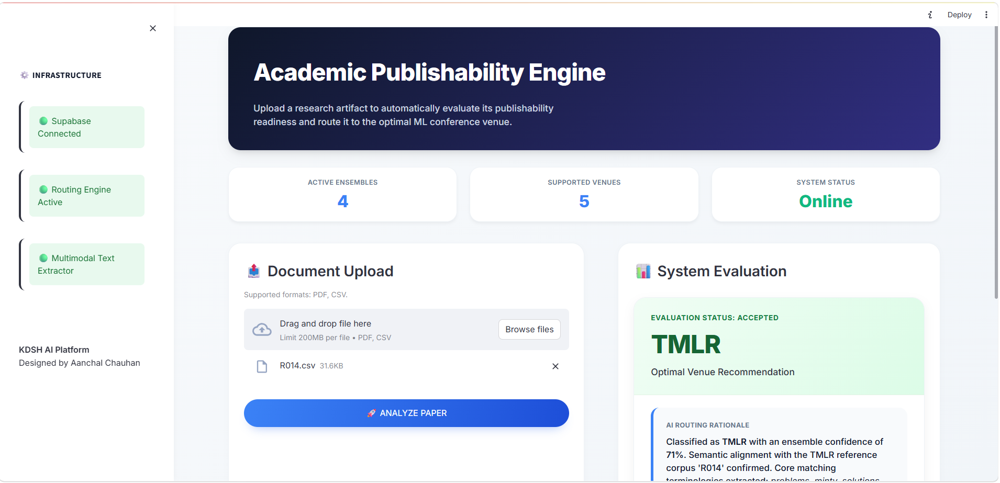

# 🎓 Academic Publishability Engine: KDSH 2025

> **An enterprise-grade, multimodal AI pipeline that evaluates research artifacts for publication readiness and dynamically routes them to optimal ML conferences.**

 *(Note: Replace with actual image path)*

---

## 🎯 Problem Statement
The academic peer-review process is notoriously slow, and researchers often struggle to identify the optimal venue for their work. Furthermore, conference organizers spend countless hours manually filtering out structurally flawed submissions.

The **Academic Publishability Engine** bridges this gap. By leveraging a multi-stage machine learning architecture—combining deep learning, semantic similarity, and classical ML ensembles—the system instantly acts as a gatekeeper for academic rigor and routes valid papers to top-tier venues (CVPR, EMNLP, KDD, NeurIPS, TMLR) with confidence-calibrated probability scoring.

---

## ✨ Key Features
* **Heuristic Gatekeeper:** Automatically filters out incomplete drafts by analyzing document depth, academic structure, and citation integrity before engaging heavy ML models.
* **4-Stage Multi-Model Ensemble:** Combines PyTorch BiGRUs, SentenceTransformers (SBERT), Zero-Shot LLM Classification, and a Classical ML Voting Ensemble (RF, LR, ET) for highly accurate routing.
* **Modern Professional UI:** A high-contrast, responsive Streamlit dashboard featuring custom CSS, dynamic probability bars, and detailed evaluation rationales.
* **Multimodal Extraction:** Seamlessly parses both complex academic PDFs (via PyMuPDF) and raw CSV data streams.
* **Secure Data Vault:** Live integration with Supabase (PostgreSQL) for secure, real-time logging of paper evaluations and routing predictions.

---

## 🛠️ Tech Stack & Infrastructure
* **Frontend:** Streamlit, Custom CSS
* **Deep Learning & NLP:** PyTorch, HuggingFace (`transformers`), `sentence-transformers`
* **Classical ML Engine:** Scikit-Learn (TF-IDF, TruncatedSVD, VotingClassifier)
* **Document Processing:** PyMuPDF (`fitz`), Pandas, Regex
* **Cloud Database & Storage:** Supabase (PostgreSQL)
* **Vector Indexing (Task 2):** Pathway RAG 

---

## 📸 System Output & Visuals

### 1. 🖥️ The Enterprise Dashboard
The main evaluation interface featuring active ensemble tracking and system status.


### 2. 🚫 Gatekeeper Rejection
Real-time structural analysis blocking a non-publishable artifact.


### 3. ✅ AI Routing Rationale
A successfully accepted paper dynamically routed to a conference, complete with keyword extraction and soft-voting probability distributions.


---

## 🚀 Local Installation & Setup

If you wish to run this evaluation pipeline on your local machine, follow these steps:

**1️⃣ Clone the repository**
```bash
git clone [https://github.com/Aanchal749/Real_Time_Paper_Publishability_Detection.git](https://github.com/Aanchal749/Real_Time_Paper_Publishability_Detection.git)
cd Real_Time_Paper_Publishability_Detection
